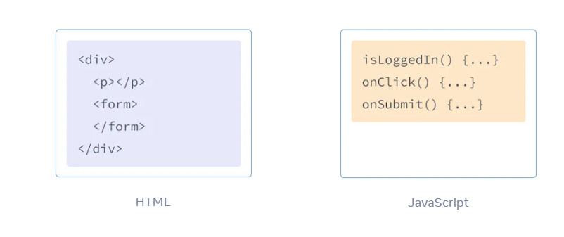
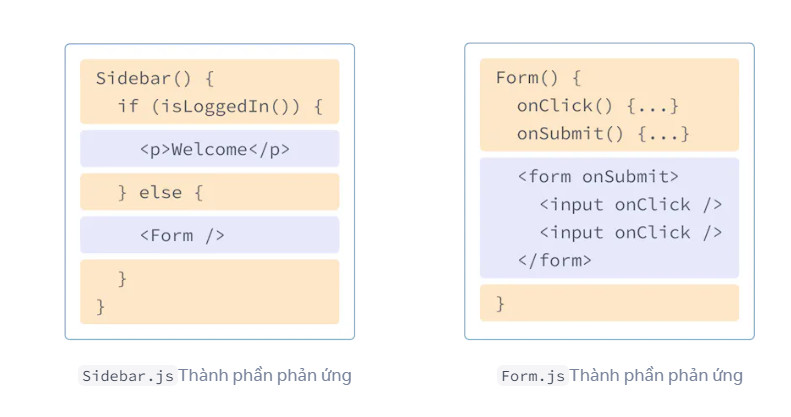

# JSX

- JSX là một phần mở rộng cú pháp cho JavaScript cho phép bạn viết đánh dấu giống HTML bên trong tệp JavaScript. Mặc dù có nhiều cách khác để viết các thành phần, nhưng hầu hết các nhà phát triển React đều thích sự đơn giản của JSX và hầu hết các cơ sở mã đều sử dụng nó.

## JSX: Đưa đánh dấu vào JavaScript

- Web đã được xây dựng trên HTML, CSS và JavaScript. Trong nhiều năm, các nhà phát triển web giữ nội dung bằng HTML, thiết kế bằng CSS và logic bằng JavaScript—thường ở các tệp riêng biệt! Nội dung được đánh dấu bên trong HTML trong khi logic của trang tồn tại riêng biệt trong JavaScript:



- Nhưng khi Web trở nên tương tác hơn, logic ngày càng quyết định nội dung. JavaScript chịu trách nhiệm về HTML! Đây là lý do tại sao trong React, logic hiển thị và đánh dấu tồn tại cùng một nơi—các thành phần.



- Việc kết hợp logic kết xuất và đánh dấu của một nút sẽ đảm bảo rằng chúng luôn đồng bộ với nhau trong mỗi lần chỉnh sửa. Ngược lại, các chi tiết không liên quan, chẳng hạn như đánh dấu của nút và đánh dấu của thanh bên, được tách biệt với nhau, giúp việc tự thay đổi một trong hai chi tiết đó an toàn hơn.

### Chú ý 

- *JSX và React là hai thứ riêng biệt. Chúng thường được sử dụng cùng nhau nhưng bạn có thể  sử dụng chúng độc lập với nhau. JSX là một phần mở rộng cú pháp, trong khi React là thư viện JavaScript.*

## Các quy tắc của JSX

1. **Trả về một phần tử gốc**
- Để trả về nhiều phần tử từ một thành phần, hãy bọc chúng bằng một thẻ cha duy nhất.

Ví dụ: bạn có thể sử dụng <div>:

```javascript
<div>
  <h1>Hedy Lamarr's Todos</h1>
  
  <ul>
    ...
  </ul>
</div>
```

- Nếu bạn không muốn thêm phần bổ sung <div> vào đánh dấu của mình, bạn có thể viết <>và </> thay vào đó: 

```javascript
<>
  <h1>Hedy Lamarr's Todos</h1>
  
  <ul>
    ...
  </ul>
</>
```
- Thẻ trống này được gọi là Fragment. Phân đoạn cho phép bạn nhóm mọi thứ mà không để lại bất kỳ dấu vết nào trong cây HTML của trình duyệt.


### Tại sao cần phải bịc nhiều thẻ JSX 

- *JSX trông giống như HTML, nhưng bên trong nó được chuyển đổi thành các đối tượng JavaScript đơn giản. Bạn không thể trả về hai đối tượng từ một hàm mà không gói chúng vào một mảng. Điều này giải thích tại sao bạn cũng không thể trả về hai thẻ JSX mà không gói chúng vào một thẻ khác hoặc một Đoạn.*

2. **Đóng tất cả các thẻ**

- JSX yêu cầu các thẻ phải được đóng rõ ràng: các thẻ tự đóng như  và các thẻ gói như <li>phải được viết dưới dạng <li>oranges</li>.

Đây là hình ảnh và danh sách các mục trông như thế nào:
```javascript
<>
  
  <ul>
    <li>Invent new traffic lights</li>
    <li>Rehearse a movie scene</li>
    <li>Improve the spectrum technology</li>
  </ul>
</>
```
3. **Quy tắc CamelCase**

- JSX biến thành JavaScript và các thuộc tính được viết bằng JSX trở thành khóa của các đối tượng JavaScript. Trong các thành phần của riêng bạn, bạn thường muốn đọc các thuộc tính đó thành các biến. Nhưng JavaScript có những hạn chế về tên biến. Ví dụ: tên của họ không được chứa dấu gạch ngang hoặc là các từ dành riêng như class.

- Đây là lý do tại sao trong React, nhiều thuộc tính HTML và SVG được viết bằng CamelCase. Ví dụ: thay vì stroke-width bạn sử dụng strokeWidth. Vì class là một từ dành riêng nên trong React bạn viết className thay thế, được đặt tên theo thuộc tính DOM tương ứng :

```javascript


```

### Cạm bẫy

- *Vì lý do lịch sử aria-** và *data-** *các thuộc tính được viết dưới dạng HTML với dấu gạch ngang.*

### Sử dụng Trình chuyển đổi JSX

- [Sử dụng trình chuyển đổi](https://transform.tools/html-to-jsx) để dịch HTML và SVG hiện có của mình sang JSX. Các trình chuyển đổi rất hữu ích trong thực tế, nhưng vẫn đáng để hiểu những gì đang diễn ra để bạn có thể thoải mái tự viết JSX.

